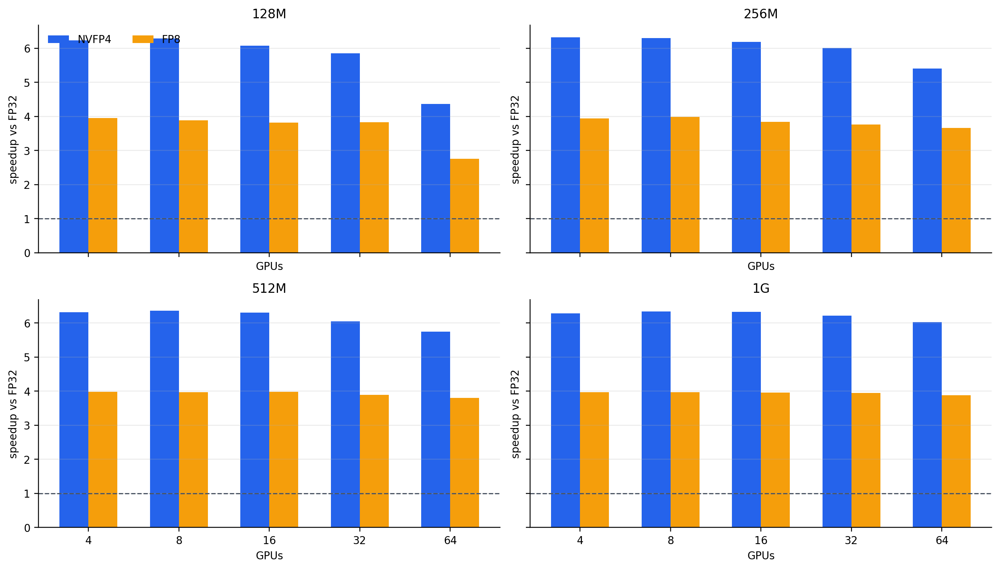
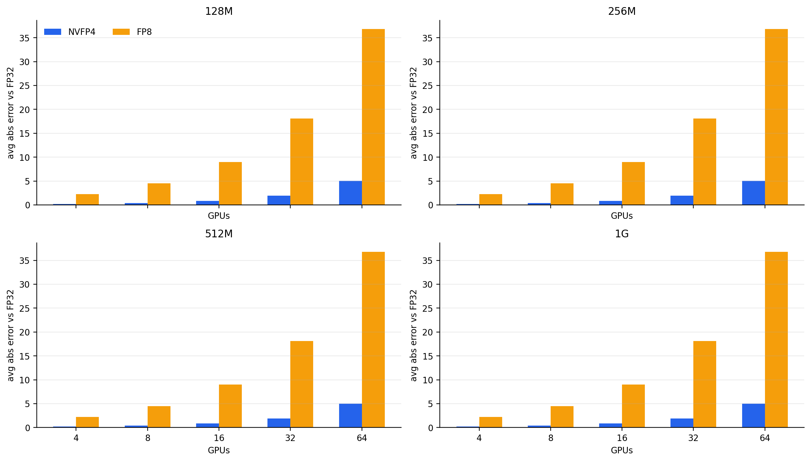
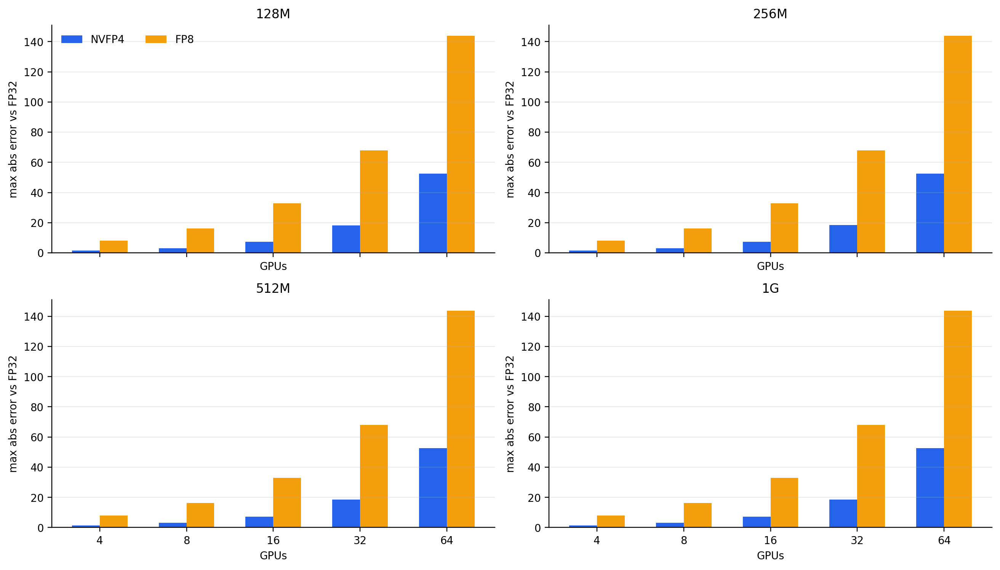

# NCCL

Optimized primitives for inter-GPU communication.

## Introduction

NCCL (pronounced "Nickel") is a stand-alone library of standard communication routines for GPUs, implementing all-reduce, all-gather, reduce, broadcast, reduce-scatter, as well as any send/receive based communication pattern. It has been optimized to achieve high bandwidth on platforms using PCIe, NVLink, NVswitch, as well as networking using InfiniBand Verbs or TCP/IP sockets. NCCL supports an arbitrary number of GPUs installed in a single node or across multiple nodes, and can be used in either single- or multi-process (e.g., MPI) applications.

For more information on NCCL usage, please refer to the [NCCL documentation](https://docs.nvidia.com/deeplearning/sdk/nccl-developer-guide/index.html).

## Experimental NVFP4 Collectives

This branch adds an experimental NVFP4 collective path for reducing the
communication volume of large all-reduce payloads. The implementation does not
depend on a public NCCL FP4 datatype. Instead, it adds a custom
`ncclAllReduceNvfp4` entry point that treats the transported payload as packed
bytes and carries NVFP4 metadata through NCCL's enqueue, scheduling, and device
work paths.

At a high level, the NVFP4 path is organized around three ideas:

1. Pack logical values into NVFP4 blocks before communication. Each NVFP4 block
   stores 16 logical values in 10 bytes: 2 bytes of scale metadata plus 8 bytes
   of 4-bit payload values. The packed byte section is aligned for NCCL
   transport.
2. Communicate packed bytes through NCCL. The collective is enqueued as an
   all-reduce over `ncclUint8`, while `transportCodec =
   ncclTransportCodecNvfp4` tells the scheduler, registration path, and device
   work descriptors that the byte stream has NVFP4 semantics. This keeps the
   network payload small while avoiding the need for a public `ncclFloat4`
   datatype.
3. Decode, reduce, and repack on the device. During the all-reduce, device
   kernels interpret the byte stream as NVFP4 blocks, decode nibbles using their
   block scales, apply the reduction, choose output scales, and pack the reduced
   values back to NVFP4. The current native ring implementation keeps NVFP4 work
   on one channel so NCCL chunking does not split the 10-byte packed blocks.

This design is useful when communication bandwidth is the bottleneck: NVFP4
reduces the transported payload relative to FP8 and FP32, but it adds
quantization, dequantization, scale selection, and packing work. On GH200, the
current implementation uses software kernels for that work; future hardware with
accelerated FP4 arithmetic can reduce this overhead, but the communication path
still needs block-aware semantics for correct all-reduce behavior.

The figures below compare NVFP4 and FP8 against FP32 using the current scaling
experiment artifacts. The timing sweep uses 5 warmup runs and averages 50
measured all-reduce runs per configuration. The accuracy figures report average
and maximum absolute error relative to FP32. Rerun the timing sweep after kernel
or channel-scheduling changes before treating the speed chart as final.







## Build

Note: the official and tested builds of NCCL can be downloaded from: https://developer.nvidia.com/nccl. You can skip the following build steps if you choose to use the official builds.

To build the library :

```shell
$ cd nccl
$ make -j src.build
```

If CUDA is not installed in the default /usr/local/cuda path, you can define the CUDA path with :

```shell
$ make src.build CUDA_HOME=<path to cuda install>
```

NCCL will be compiled and installed in `build/` unless `BUILDDIR` is set.

By default, NCCL is compiled for all supported architectures. To accelerate the compilation and reduce the binary size, consider redefining `NVCC_GENCODE` (defined in `makefiles/common.mk`) to only include the architecture of the target platform :
```shell
$ make -j src.build NVCC_GENCODE="-gencode=arch=compute_90,code=sm_90"
```

## Install

To install NCCL on the system, create a package then install it as root.

Debian/Ubuntu :
```shell
$ # Install tools to create debian packages
$ sudo apt install build-essential devscripts debhelper fakeroot
$ # Build NCCL deb package
$ make pkg.debian.build
$ ls build/pkg/deb/
```

RedHat/CentOS :
```shell
$ # Install tools to create rpm packages
$ sudo yum install rpm-build rpmdevtools
$ # Build NCCL rpm package
$ make pkg.redhat.build
$ ls build/pkg/rpm/
```

OS-agnostic tarball :
```shell
$ make pkg.txz.build
$ ls build/pkg/txz/
```

## Tests

Tests for NCCL are maintained separately at https://github.com/nvidia/nccl-tests.

```shell
$ git clone https://github.com/NVIDIA/nccl-tests.git
$ cd nccl-tests
$ make
$ ./build/all_reduce_perf -b 8 -e 256M -f 2 -g <ngpus>
```

## Copyright

All source code and accompanying documentation is copyright (c) 2015-2020, NVIDIA CORPORATION. All rights reserved.
